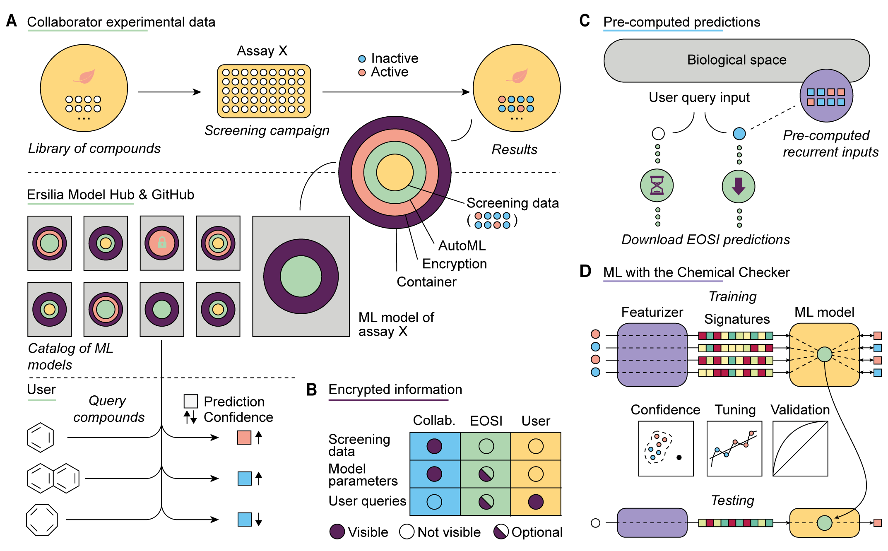

# Project ideas for the Google Summer of Code
## An introduction to the Ersilia Model Hub
The Ersilia Model Hub is a web-based platform maintained by Ersilia Open Source Initiative (EOSI). It features Machine Learning (ML) models for biomedicine and drug discovery, with a focus on infectious and neglected diseases. Its aim is to bring ML closer to biomedical research and empower uninitiated researchers in the world of computational pharmacology.

To get a feeling of what we do, you can scroll through our documentation and have a look at the preliminary version of the platform [here](https://ersilia-hub.netlify.app).

If you want to get inspired, see our previous work and understand the potential impact of the project, please do read some of our [academic publications]( https://ersilia-hub.netlify.app/docs/publications). We hope they are appealing to you even if your background is not in life sciences!

### Technical details of the Hub
Before continuing, find below a few specifications of the Ersilia Model Hub:
* Alpha release, scheduled 21st of March 2021, will contain 10 models related to drug discovery collected from the scientific literature.
* Beta release, scheduled 23rd of September 2021, will contain at least 100 models, 50% of them developed in-house in collaboration with research laboratories worldwide.
* Our code is available on [GitHub](https://github.com/ersilia-os). We use [GitHub Actions](https://github.com/features/actions) and [CircleCI](https://circleci.com) for CI/CD.
* We do not have an ML framework of choice. We have experience with conventional Python libraries such as [SciKit Learn](https://scikit-learn.org/stable/) as well as deep learning libraries like [TensorFlow](https://www.tensorflow.org/), [Keras](https://keras.io/) and [PyTorch](https://pytorch.org/).
Models are containerized with [Docker](https://www.docker.com/). We also use [Conda](https://www.anaconda.com/) environments.
* To bring models to production, we use [BentoML](https://www.bentoml.ai), a framework-agnostic platform for model deployment.
* We store predictions in a [DynamoDB](https://aws.amazon.com/dynamodb/) database.
* The Ersilia Model Hub website is built with [Vue.js](https://vuejs.org/).
* ML models are deployed in the cloud. Provisionally, we use [Heroku](https://www.heroku.com/), although we have plans for migration to [Google Cloud](https://cloud.google.com/) in the following months.

## Our compromise
The Ersilia team is a small but highly motivated group. We are looking for new contributors to increase our community. If you are selected, you can expect intense guidance from our mentors, specifically allocated weekly time for discussions and debugging, and fair and transparent evaluation process. Coming from an academic background, we are fully aware of the importance of credit and authorship. We will make sure your contributions are acknowledged.

## Project ideas
We have listed some ideas to inspire students, but we welcome project proposals that are a modification of any of the below, a combination of them or even a completely different proposal. Do [get in touch](mailto:hello@ersilia.io) with the mentors if you plan to apply!

### Idea 1: Automated deployment of ML models in a web-based App

* Level: Beginner
* Required skills: Python, Docker
* Mentors: Miquel, Gemma

#### Background
A key step towards our mission is the deployment of ML models as intuitive, user-friendly web applications to be used by biologists, clinicians and pharmacologists with no coding expertise. Our goal is to achieve 100 models by September 2021, and hopefully we will have over 500 by the end of the year. We are convinced that such a resource will be transformative for the daily life of many laboratories worldwide (think about the number of laborious and costly experiments that could be avoided or accelerated with the aid of ML, and about the number of laboratories in low-resourced settings that would benefit from a free tool that runs on the cloud). However, designing an App de novo for each of the models is not feasible and, more importantly, it would end up being confusing for the user. We prefer a unified format and aesthetics for all of our models, even if they tackle very different problems (drug toxicity prediction, identification of key mutations in cancer cells, etc.). [HuggingFace](https://huggingface.co/) is a good example of a platform with a unified inference API and web interface.

#### Project description

In this project, the student is offered the opportunity to develop a Python library for the (semi)automated generation of front-end interface for our pre-trained ML models. A typical ML Ersilia model takes as input a short text describing a small molecule (a drug, for instance) and returns as output a short text corresponding to a predicted property of the molecule, e.g a drug side effect. Our current solution is based on the great and simple [StreamLit](https://www.streamlit.io/) library, but we welcome [Dash](https://dash.plotly.com/), [Vue.js](https://vuejs.org/) or any other option, actually!

#### Expected outcomes:
Keep your proposal realistic, the allocated working time is 175h, so we do not necessarily expect your proposal to fulfil all the items below:
* Homogeneous front-end interface format defined.
* App integration for existing Models
* Automated generation of web interfaces for new models

### Idea 2: A large-scale database of pre-computed predictions across the Ersilia Model Hub

* Level: Intermediate
* Required skills: Python, NoSQL
* Mentors: Miquel, Edoardo

#### Background
We have been in the field of biomedicine for long enough now to realize that many scientists focus on the [same genes](https://www.nature.com/articles/d41586-017-07291-9), molecules, diseases and pathogens over and over again. Some topics and research questions are simply more fashionable and queried more often. In the context of the Ersilia Model Hub, this means that (1) certain ML models will be more popular than others and (2) some inputs will be recurrently entered by users. Running predictions takes time and resources, no matter how good you are at bringing your model to production. It makes sense to try to anticipate user queries through a database of pre-computed predictions, so that when users enter a popular input they will get an output with minimal latency.

#### Project description
In this project, the student will build such a database, including the most popular models of the Ersilia Model Hub and the most likely inputs for these models. At project commencement, we will provide the student with a predefined set of models and inputs. The student will run large-scale prediction tasks and store the outputs in a database. We expect the schema of the database to be simple, with a plain (model, input) key and flexible attributes fields, corresponding to a diversity of output structures, depending on the model. We believe that a NoSQL database is ideal for this task. Currently, we are experimenting with [DynamoDB](https://aws.amazon.com/dynamodb/), although we are open to suggestions (e.g. [Cloud Bigtable](https://cloud.google.com/bigtable)). Load balancing, scaling and low storage cost are a priority.

The number of possible queries for our Hub is not infinite, but it is very large. Consider that we will have 100 models by September 2021. As for inputs, there are over 20,000 genes in the human genome, and the number of existing small molecules surpasses the 100 million; to this, one should add thousands of known diseases, cell types and pathogens. Thus, prioritization of model-input pairs is essential. Although we do have a predefined list of popular models and likely inputs, this has been hand made based on our experience and intuition. Depending on the progress of the project, we would be very interested in exploring more dynamic, data-driven ways of prioritizing tasks for pre-computed predictions. We are widely open to suggestions here. One possibility would be to survey the public domain (datasets, literature, etc.) with the goal of identifying the most popular entities in the current scientific landscape. Another possibility would be to capture actual user queries in the Ersilia Model Hub.

#### Expected outcomes:
Keep your proposal realistic, the allocated working time is 175h, so we do not necessarily expect your proposal to fulfil all the items below:
* NoSQL database scheme for storing predictions.
* Precomputation of a number of given tasks.
* Model development to identify most queried biological entities.
* Pipeline to prioritize predictions based on the Ersilia Model Hub usage.

### Idea 3: Encryption of sensible biological information

* Level: Intermediate
* Required skills: Python, TensorFlow
* Mentors: Miquel, Gemma

#### Background
A key resource for Open Source research in drug discovery is the accessibility to libraries of compounds enriched in hits. Pharma companies have, over the years, collected and curated collections of potential hits that now constitute their main asset, and is therefore of utmost importance to identify avenues by which Open Source projects could benefit from this knowledge without compromising the industry’s IP.

#### Project description
In this project, the student will develop an automated encryption protocol for such libraries, latest advances in encrypted computation and homomorphic encryption applied to the field of ML: [PySyft](https://github.com/OpenMined/PySyft) or [TF-encrypted](https://tf-encrypted.io/ )

#### Expected outcomes:
Keep your proposal realistic, the allocated working time is 175h, so we do not necessarily expect your proposal to fulfil all the items below:
* Encryption model for molecule information (structure, function, interactors etc.)
* Encryption model for genetic information (genotyping, transcriptomics analysis etc.)
* Automated protocol for feeding encrypted information to the Chemical Checker (see below).

### Idea 4: Transfer learning and AutoML to populate the Ersilia Model Hub

* Level: Advanced
* Technical requirements: Python, TensorFlow, MLOps, Kubernetes
* Mentors: Miquel

#### Background
At Ersilia, we believe that the best science is done in [collaboration](https://www.sciencemag.org/careers/2012/07/how-collaborate) with others. We partner with researchers in laboratories and hospitals worldwide, and help them adopt ML assets customized to their needs. Key to the successful implementation of this approach is the quality of the models built by our team, and also the scaling-up of our capacity to collaborate with more than a handful laboratories at a time. To this aim, we are currently developing a fully-automated pipeline (AutoML) that should allow us to provide state-of-the-art ML models out of the box, in an end-to-end fashion. This sounds far-fetched (it would certainly be in many scenarios), but please take into account that our team has a 9-year long experience in the (relatively narrow) field of computational biology, which means that by now we have come up with a pipeline that encodes for the necessary expert-rules. In particular, our methodology builds upon the [Chemical Checker](https://bioactivitysignatures.org), a resource of ‘bioactivity signatures’ [developed](https://www.nature.com/articles/s41587-020-0502-7) by us and recently published in a high-profile journal like Nature Biotechnology. The Ersilia AutoML methodology applies ‘transfer learning’ from the Chemical Checker and is able to assign a confidence score to predictions, intrinsically prevents overfitting and outputs cross-validated performance reports. In the MoleculeNet benchmark dataset, a primitive version of this pipeline has shown [outstanding performance](https://www.biorxiv.org/content/10.1101/2020.07.21.214197v2.full); in a recent [DREAM Challenge](http://dreamchallenges.org/) (CTD-squared Pancancer Activity Prediction), the Chemical Checker was a [top-performing](https://www.biorxiv.org/content/10.1101/2020.12.21.423514v2) team.

#### Project description
In this project, the student will be responsible for bringing our current pipeline (which is, quite honestly, just a prototype) to [MLOps](https://cloud.google.com/solutions/machine-learning/mlops-continuous-delivery-and-automation-pipelines-in-machine-learning) standards. Thus, the pipeline implemented by the student should bring together all of the steps of the ML life cycle, including training, tuning, validation and deployment of ML models. As challenging as this may sound, this project is a crucial step in our 2021 roadmap and we can guarantee in-depth supervision, assistance and guidance. And ¡no panic!, nothing will be done from scratch. Many of the steps (for example, hyper-parameter validation) are already available as Docker containers and it is just a matter of orchestrating them with Kubernetes or the likes.

#### Expected outcomes:
Keep your proposal realistic, the allocated working time is 175h, so we do not necessarily expect your proposal to fulfil all the items below:
* Training protocols containerized in Docker.
* Validation protocols containerized in Docker.
* Deployment protocols (including front-end interface from Idea1) containerized in Docker.
* Pipeline orchestration of all steps for model generation.

### Figure 1. Overview of the Ersilia Model Hub

(A) As an idealized example, we show a screening campaign (assay X) performed by one of our collaborators. Some hit molecules are identified while the majority of screened compounds are inactive. EOSI’s end-to-end ML pipeline will revisit the complete screening dataset. The resulting ML model of assay X will be incorporated into the Ersilia Model Hub. In addition, the model will be discoverable through other popular repositories such as GitHub, furthering Open Science. The end User will be able to interact with the model of assay X querying compounds and obtaining an active/inactive prediction (with a confidence score).(B) Visibility of computational assets of the project, including screening results, model parameters and predictions. (C) The user query will fall in one of the following categories; 1) unknown molecule for which the model has to predict the activity 2) frequently queried molecule for which EOSI has stored the output. The time between input and result varies significantly from one scenario to another. (D) State-of-the-art ML models are enabled by Chemical Checker signatures, acting as a ‘transfer learning’ intermediate step for robust training. EOSI’s ML pipeline estimates confidence of prediction, automatically tunes model parameters, and provides validation reports.

## Next steps

If any of the ideas above has tickled you, or you are particularly motivated by EOSI's mission, apply with us for this edition of GSoC! Here are the next steps:

1. Introduce yourself
Join our [Slack group](https://ersilia-workspace.slack.com), particularly the #gsoc_general channel, and say Hi. We want to know who you are, your background, interests… and what motivated you to join our team.

2. Contact the mentors
You can also write private messages to any of the mentors using the slack private channels. Don’t be shy, we are there to solve your questions.

3. Write your proposal
In the proposal, we would like to see the following items, but don’t restrict yourself to them if you feel like adding more information.
* Project title
* Summary (200w)
* Milestones
* What will be the impact of the project? (150w)
* Why are you interested in doing it? (150w)
* Do you have any previous experience? (100w)
